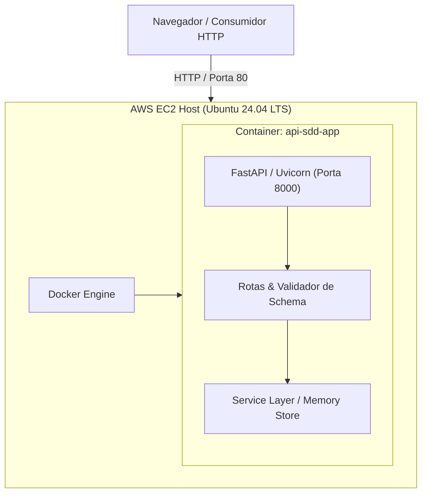

# Software Design Document (SDD)
## Projeto: Task & Service Health API (SDD + AWS + CI/CD)

**Integrantes da Dupla:**
- Estudante 1: Misael Pablo Sardá - DevOps & Cloud Lead
- Estudante 2: Vinicius Policarpo Macedo - Software Engineer & SDD Lead

**Data:** 16 de Setembro de 2026  
**Versão:** 1.0.0  

---

## 1. Introdução e Propósito

Este documento descreve a especificação de engenharia de software elaborada seguindo a abordagem **Spec-Driven Development (SDD)** / **Schema-Driven Development**.

O objetivo do sistema é fornecer uma API RESTful robusta, documentada e com alta disponibilidade para gestão de tarefas e monitoramento de saúde de serviços, servindo como base para a esteira contínua de CI/CD, auditoria de segurança estática com SonarQube e publicação na nuvem Amazon Web Services (AWS).

---

## 2. Abordagem Metodológica: Spec-Driven Development (SDD)

No desenvolvimento orientativo por especificação (SDD):
1. **Contrato Primeiro (Contract-First):** O contrato da API é concebido e formalizado no padrão OpenAPI 3.0 (`docs/openapi.yaml`) antes de qualquer linha de código de implementação.
2. **Validação Estrita de Esquema (Schema Validation):** Os modelos de dados no backend (Pydantic) refletem estritamente as regras de tipos, limites de caracteres e campos obrigatórios estabelecidos no esquema OpenAPI.
3. **Testes Baseados em Contrato:** Os testes automatizados validam se os códigos de status HTTP e os payloads retornados estão 100% em conformidade com a especificação original.

---

## 3. Requisitos do Sistema

### 3.1. Requisitos Funcionais (RF)
- **RF01 - Health Check do Sistema:** O sistema deve fornecer um endpoint (`GET /health`) para validação de liveness e readiness contendo status, timestamp e versão atual.
- **RF02 - Criação de Tarefas:** O sistema deve permitir a criação de novas tarefas (`POST /api/v1/tasks`) com validação de título (3 a 100 caracteres), descrição opcional e prioridade (`LOW`, `MEDIUM`, `HIGH`).
- **RF03 - Listagem de Tarefas:** O sistema deve listar todas as tarefas cadastradas (`GET /api/v1/tasks`), com suporte a filtro por status (`PENDING`, `IN_PROGRESS`, `COMPLETED`).
- **RF04 - Consulta por Identificador:** O sistema deve retornar os detalhes de uma tarefa específica a partir de seu ID numérico (`GET /api/v1/tasks/{id}`). Caso não exista, deve retornar HTTP 404.
- **RF05 - Atualização de Tarefa:** O sistema deve permitir atualizar os dados e o status de uma tarefa (`PUT /api/v1/tasks/{id}`).
- **RF06 - Exclusão de Tarefa:** O sistema deve permitir remover uma tarefa existente (`DELETE /api/v1/tasks/{id}`) com retorno HTTP 204.
- **RF07 - Métricas e Diagnóstico:** O sistema deve expor informações da aplicação (`GET /api/v1/info`) para monitoramento pelo pipeline de deploy.

### 3.2. Requisitos Não-Funcionais (RNF)
- **RNF01 - Portabilidade:** O sistema deve ser empacotado em container OCI padronizado (Docker).
- **RNF02 - Segurança de Código (SAST):** Todo código deve atingir aprovação no Quality Gate do SonarQube/SonarCloud, com zero vulnerabilidades críticas e cobertura de testes unitários superior a 80%.
- **RNF03 - Automação Total:** Todo push na branch `main` deve disparar a suíte de testes, análise de segurança e deploy em ambiente AWS sem intervenção manual.
- **RNF04 - Disponibilidade:** O sistema deve estar exposto publicamente na internet via instância EC2 com roteamento na porta HTTP 80.

---

## 4. Arquitetura da Solução

---

## 5. Estrutura de Dados e Esquemas

### Modelo: `TaskCreate`
| Campo | Tipo | Obrigatório | Restrições |
| :--- | :--- | :--- | :--- |
| `title` | String | Sim | Mínimo: 3 caracteres, Máximo: 100 caracteres |
| `description` | String | Não | Máximo: 500 caracteres |
| `priority` | String (Enum) | Não | Valores: `LOW`, `MEDIUM`, `HIGH` (Default: `MEDIUM`) |

### Modelo: `TaskResponse`
| Campo | Tipo | Descrição |
| :--- | :--- | :--- |
| `id` | Integer | Identificador único autoincrementado |
| `title` | String | Título da tarefa |
| `description` | String / Null | Descrição detalhada |
| `priority` | String | Prioridade da tarefa |
| `status` | String (Enum) | `PENDING`, `IN_PROGRESS`, `COMPLETED` |
| `created_at` | String (ISO 8601) | Data/hora de criação |
| `updated_at` | String (ISO 8601) | Data/hora da última alteração |

---

## 6. Considerações de Segurança e Qualidade (SonarQube)
1. **Ausência de Hardcoded Secrets:** Nenhuma credencial ou chave privada deve constar no repositório; todas as variáveis devem ser injetadas via GitHub Secrets ou variáveis de ambiente.
2. **Tratamento Seguro de Exceções:** Erros internos de servidor não devem expor stack traces ou dados sensíveis aos clientes HTTP.
3. **Quality Gate:** A pipeline será automaticamente abortada se novos bugs, vulnerabilidades de segurança (Vulnerabilities/Security Hotspots) ou débitos técnicos ultrapassarem os limites da política da SonarSource.
